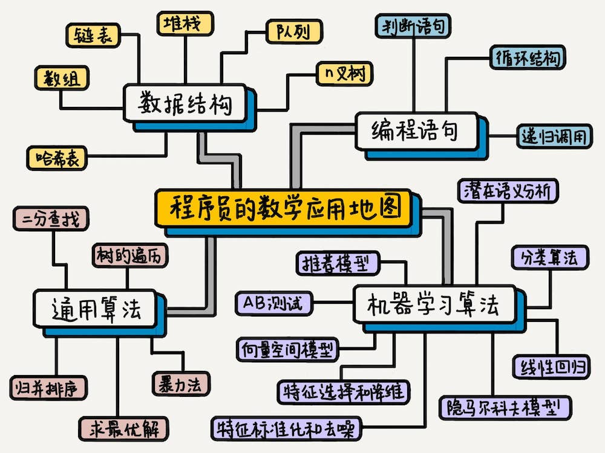

[《程序员的数学基础课 —— 在实战中重新理解数学》](https://time.geekbang.org/column/intro/143)学习笔记

--------------

这里是我学习极客时间里[《程序员的数学基础课 —— 在实战中重新理解数学》](https://time.geekbang.org/column/intro/143)课程的一系列笔记。

### 程序员为什么要学好数学

>  “如果你只想当一个普通的程序员，那么数学对你来说，并不重要。但是如果你想做一个顶级程序员，梦想着改变世界，那么数学对你来说就很重要了。“

**数学其实是一种思维模式，考验的是一个人归纳、总结和抽象的能力。**对应于程序员的世界里，就是**解决问题的能力**。

**如果编程语言是血肉，数学的思想和知识就是灵魂。**它可以帮助我们选择合适的数据结构和算法、提升系统效率、并且赋予机器智慧。在大数据和智能化的现在和未来，更是如此。

简单🌰：

**余数**在编程里的应用。**分页**功能，根据记录的总条数和每页展示的条数，最后来计算整体的页数。复杂一点还有**奇偶校验、循环冗余检验、散列函数、密码学**等等。

**深度学习**就涉及到微积分、线性代数、概率论。

广告中的**竞价问题**，可以变成一个博弈论中“**寻找上策均衡**”的问题。

事实上，大部分应用领域的核心解决方案，都是把应用领域的问题，形式化为一个个数学问题。

### 程序员应该怎么学习数学

> “学数学就像学一门新技术”

学习新技术的三个阶段：怎么**使用**；如何实现，**原理**是什么；**为什么**这么实现。

不能为了数学而学数学，学数学要和具体的应用结合在一起。

**从工作相关的领域开始**，是让自己一是能有实际用得上学到的知识的的机会，二是日常工作中容易耳濡目染，相当于常常在复习。而**先有广度**，是让自己在心中有一个问题到解决方法的“地图”，遇到具体的问题能够对得上，容易获得正反馈；然后**再有深度**，具体去对一个特定的主题学习应用。

> “数学是工具而非问题，是手段而非目的”

总的来说，**把握数学的工具属性，学习具体方法时先溯因再求果，勤于思考解决相同问题的不同方法，与解决不同问题的相同方法之间的联系与区别**。

### 程序员的数学应用地图

### 课程介绍和目录

#### 一、基础思想篇

梳理编程中最常用的数学概念和思想。

#### 二、概率统计篇

以概率统计中最核心的**贝叶斯公式**为圆心，向上讲解**随机变量**、**概率分布**这些基础概念，向下讲解**朴素贝叶斯**，并分析它们在生活和编程中的实际应用。

#### 三、线性代数篇

从线性代数中最核心的概念**向量**、**矩阵**、**线性方程**入手，逐步深入分这些概念是如何与计算机互帮互助，融会贯通，解决实际问题的。

#### 四、综合实战篇

通过缓存系统、搜索引擎、推荐系统中的实际应用来学习之前的知识。