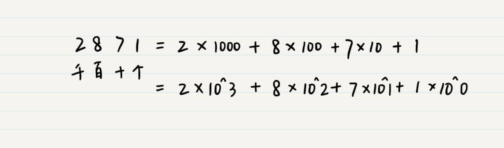
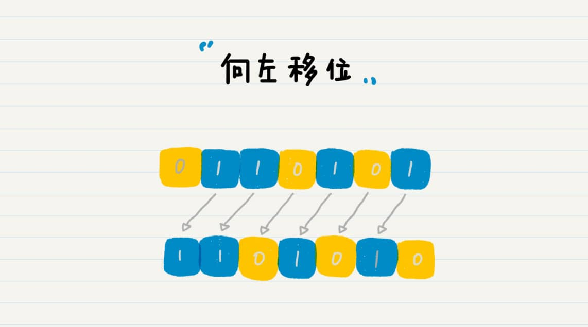

## 01-二进制：了解计算机的源头


### 1 什么是二进制计数法？

人类计数的发展史：

1. 原始时代，路边小石子统计放牧羊的数量；

2. 罗马人，用手指计数，在羊皮上画**I**、**II**、**III**来替代手指数量，**V**来表示一只手，**VV**表示两只手；

3. 公元3世纪左右，印度数学家（或是阿拉伯人）发明阿拉伯数字，并采用**进位制法**；

4. 以阿拉伯数字为基础，产生了**十进制计数法**；

   

   其中 **^** 表示幂或次方运算。十进制的数位（千位、百位、十位等）全部都是10^n的形式。10被称为十进制计数法的**基数**。

5. 类比，**二进制的数位就是2^n的形式**；

   

6. 同样，也可以推导产生**八进制**、**十六进制**等等计数法；


### 2 计算机为什么使用二进制？

计算机使用二进制和现代计算机系统的**硬件实现**有关。组成计算机系统的逻辑电路通常只有两个状态，即开关的**接通**与**断开**，分别可用1、0表示。只有两种状态，即便系统受到干扰，也能分辨出来，因此使用二进制具有**抗干扰能力强、可靠性高**的优点。相比之下，如果用十进制设计具有 10 种状态的电路，情况就会会非常复杂，判断状态的时候出错的几率就会大大提高。

另外，**二进制也非常适合逻辑运算**。


### 3 二进制的位操作/位运算

#### 3.1 向左移位



**二进制左移一位，其实就是将数字翻倍**。`110101 (53)` 向左移一位变成`1101010(106)`

向左移位需要注意**数字溢出**，也就是二进制位数超过了系统指定的位数（目前一般是32位或64位）。

#### 3.2 向右移位


**二进制右移一位，就是将数字除以 2 并求整数商的操作**。

#### 位的“或”


#### 位的“与”


#### 位的“异或”


## 02-余数：原来取余操作本身就是个哈希函数

**同余定理**：两个正整数a和b，如果它们除以正整数m得到的余数相等，就认为a和b对于**模m**同余。示例：

100天里，所有星期一的这些天都是同余的；


奇数和偶数，可以看作是模为2的同余应用；

...


整数是没有边界的，它可能是正无穷，也可能是负无穷。**余数总是在一个固定的范围内**(0~m，不包括m)。同余定理就可以**用来均分**了。

哈希（Hash，散列）就是**将任意长度的输入，通过哈希算法，压缩为某一固定长度的输出**。


#### 使用余数思想的例子

循环冗余校验，[最大公约数](https://baike.baidu.com/item/最大公约数/869308?fr=aladdin)，[模幂运算](https://baike.baidu.com/item/蒙哥马利幂模运算/10566438?fr=aladdin&fromid=16255096&fromtitle=模幂运算)(DES、AES、RSA)，[凯撒密码](https://baike.baidu.com/item/恺撒密码/4905284?fromtitle=凯撒密码&fromid=1336345&fr=aladdin)，[孙子定理](https://baike.baidu.com/item/孙子定理/2841597?fr=aladdin)，[水仙花数](https://baike.baidu.com/item/水仙花数/2746160?fr=aladdin)，闰年的计算都是以模运算为基础的。


## 03-迭代法：不用编程语言的自带函数，你会如何计算平方根？

64格象棋盘算麦粒，在数学上，对应的就是，**迭代法**（Iterative Method）。

### 什么迭代法？

**简单说，就是不断地用旧的变量值，递推计算新的变量值**。

大臣要求每一格的麦子都是前一格的两倍，那么前一格里麦子的数量就是旧的变量值，我们可以先记作 X<sub>n−1</sub>；而当前格子里麦子的数量就是新的变量值，我们记作 X<sub>n</sub>。这两个变量的递推关系就是这样的：


这可通过计算机语言中的**循环语言**来实现。

```java
public class Lesson3_1 {
    /**
    * @Description: 算算舍罕王给了多少粒麦子
    * @param grid- 放到第几格
    * @return long- 麦粒的总数
    */

    public static long getNumberOfWheat(int grid) {
     
     long sum = 0;      // 麦粒总数
     long numberOfWheatInGrid = 0;  // 当前格子里麦粒的数量
     
     numberOfWheatInGrid = 1;  // 第一个格子里麦粒的数量
     sum += numberOfWheatInGrid;  
     
     for (int i = 2; i <= grid; i ++) {
      numberOfWheatInGrid *= 2;   // 当前格子里麦粒的数量是前一格的 2 倍
      sum += numberOfWheatInGrid;   // 累计麦粒总数
     }
     
     return sum;

    }
}
```

到第63格时，总共需要多少麦粒：

```java
  public static void main(String[] args) {
  System.out.println(String.format(" 舍罕王给了这么多粒：%d", Lesson3_1.getNumberOfWheat(63)));
  }
```

计算的结果是 9223372036854775807，多到数不清了。估算了一下，一袋 50 斤的麦子估计有 130 万粒麦子，那么 9223372036854775807 相当于 70949 亿袋 50 斤的麦子！（64格已经超出Java中long型的范围了）

### 迭代法的具体应用

运用方面：

- **求数值的精确或者近似解**。二分法（Bisection method）和牛顿迭代法（Newton's method）

- **在一定范围内查找目标值**。二分查找

- **机器学习算法中的迭代**。K- 均值算法（K-means clustering）、PageRank 的马尔科夫链（Markov chain）、梯度下降法（Gradient descent）等等。
- 极客时间版权所有: https://time.geekbang.org/column/article/72243

具体说明。

#### 1. 求方程的精确或者近似解

迭代法可进行**无穷次地逼近**，求得方程的精确或者近似解。

假如，如何计算某个给定正整数 n（n>1）的平方根？

这个平方根一定小于 n 本身，并且大于 1。问题就转换成，在 1 到 n 之间，找一个数字等于 n 的平方根。

采用**二分法**。每次查看区间内的中间值，检验它是否符合标准。

假设要找到 10 的平方根。我们需要先看 1 到 10 的中间数值，也就是 11/2=5.5。5.5 的平方是大于 10 的，所以我们要一个更小的数值，就看 5.5 和 1 之间的 3.25。由于 3.25 的平方也是大于 10 的，继续查看 3.25 和 1 之间的数值，也就是 2.125。这时，2.125 的平方小于 10 了，所以看 2.125 和 3.25 之间的值，一直继续下去，直到发现某个数的平方正好是 10。


代码：

```java
public class Lesson3_2 {
 
 /**
    * @Description: 计算大于 1 的正整数之平方根
    * @param n- 待求的数, deltaThreshold- 误差的阈值, maxTry- 二分查找的最大次数
    * @return double- 平方根的解
    */
    public static double getSqureRoot(int n, double deltaThreshold, int maxTry) {
     
     if (n <= 1) {
      return -1.0;
     }
     
     double min = 1.0, max = (double)n;
     for (int i = 0; i < maxTry; i++) {
      double middle = (min + max) / 2;
      double square = middle * middle;
      double delta = Math.abs((square / n) - 1);
      if (delta <= deltaThreshold) {
       return middle;
      } else {
       if (square > n) {
        max = middle;
       } else {
        min = middle;
       }
      }
     }
     
     return -2.0;

    }
}
```

测试：

```java
public static void main(String[] args) {
  
  int number = 10;
  double squareRoot = Lesson3_2.getSqureRoot(number, 0.000001, 10000);
  if (squareRoot == -1.0) {
   System.out.println(" 请输入大于 1 的整数 ");
  } else if (squareRoot == -2.0) {
   System.out.println(" 未能找到解 ");
  } else {
   System.out.println(String.format("%d 的平方根是 %f", number, squareRoot));
  }
  
 }
```

#### 2. 查找匹配记录

同样适用**二分法**。

在自然语言处理中，我们经常要处理同义词或者近义词的扩展。这时，你手头上会有一个同义词 / 近义词的词典。对于一个待查找的单词，我们需要在字典中找出这个单词，以及它所对应的同义词和近义词，然后进行扩展。比如说，这个字典里有一个关于“西红柿”的词条，其同义词包括了“番茄”和“tomato”。


那么，在处理文章的时候，当我们看到了“西红柿”这个词，就去字典里查一把，拿出“番茄”“tomato”等等，并添加到文章中作为同义词 / 近义词的扩展。这样的话，用户在搜索“西红柿”这个词的时候，我们就能确保出现“番茄”或者“tomato”的文章会被返回给用户。

乍一看到这个任务的时候，你也许想到了哈希表。没错，哈希表是个好方法。不过，如果不使用哈希表，你还有什么其他方法呢？这里，我来介绍一下，用二分查找法进行字典查询的思路。

第一步，将整个字典先进行排序（假设从小到大）。二分法中很关键的前提条件是，所查找的区间是有序的。这样才能在每次折半的时候，确定被查找的对象属于左半边还是右半边。

第二步，使用二分法逐步定位到被查找的单词。每次迭代的时候，都找到被搜索区间的中间点，看看这个点上的单词，是否和待查单词一致。如果一致就返回；如果不一致，要看被查单词比中间点上的单词是小还是大。如果小，那说明被查的单词如果存在字典中，那一定在左半边；否则就在右半边。

第三步，根据第二步的判断，选择左半边或者后半边，继续迭代式地查找，直到范围缩小到单个的词。如果到最终仍然无法找到，则返回不存在。

当然，你也可以对单词进行从大到小的排序，如果是那样，在第二步的判断就需要相应地修改一下。

在 a 到 g 的 7 个字符中查找 f 的过程:


这个方法的整体思路和二分法求解平方根是一致的，主要区别有两个方面：第一，**每次判断是否终结迭代的条件不同**。求平方根的时候，我们需要判断某个数的平方是否和输入的数据一致。而这里，我们需要判断字典中某个单词是否和待查的单词相同。第二，二分查找需要确保被搜索的空间是**有序的**。